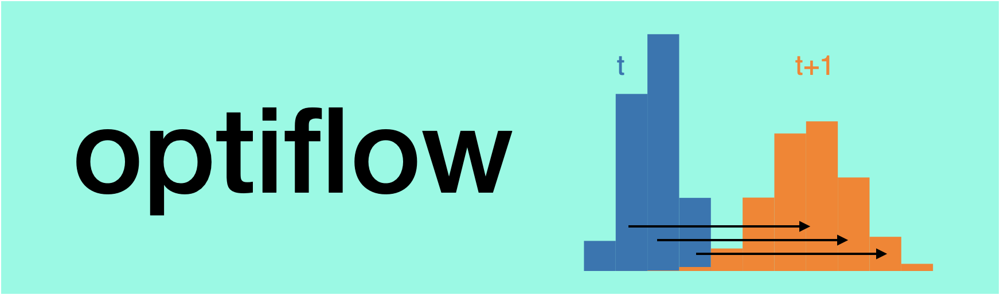
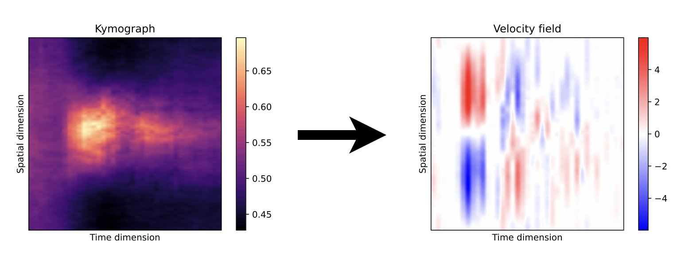

# optiflow


**optiflow** is an algorithm designed to reconstruct **velocity fields** from **kymographs** with **optimal transport**. Indeed, optimal transport computes the velocity field of minimal work, which is relevant under a wide array of situations and does not necessitates hard physical assumptions, except for the conservation of the physical quantity that we are measuring across time.
This software is designed to offer cell biologists a simple method to obtain flow fields around a membrane contour (taking into account boundary conditions) for free, offering a quantitative measurement for a flow that can only be observed visually otherwise.


---
## Example



Load an instance segmentation, reconstruct its multimaterial mesh, and extract its geometry:

```shell
pip install optiflow`

```

```py
from optiflow import define_matrices, compute_displacements_from_kymograph,plot_vector_field

## Load the kymograph
import numpy as np 
K = np.load("Kymograph_example.npy")
nt =  len(K)

#Define the distance matrices (we use circular boundary condition) and compute the displacements
C,D = define_matrices(npoints = nt,plot=True)
V = compute_displacements_from_kymograph(K,C,D)

#Visualize 
import matplotlib.pyplot as plt
vmin = min(np.abs(V.min()),V.max())
plt.imshow(V.clip(-vmin,vmin),plt.cm.bwr,extent = (0,1,0,1))
plot_vector_field(V,t=7,pool_size = 25)

```
---

### API and Documentation

#### The kymograph K 
By convention, the kymograph `K` is a `nb * nt` matrix, where nb is the number of bins used to discretize the space, and nt is the number of time points. 


- `define_matrices(npoints, plot=False)` computes the distance and cost matrices according to the kymograph. 
    - `return C,D`, where `C` is the cost matrix and `D` is the distance matrix


#### Computation of displacement fields from kymographs
- `compute_displacements_from_kymograph(K,C,D)` compute the displacement field using optimal transport
	- `return V`, a `nb * (nt-1)` matrix of the velocity fields inferred. 

---

**optiflow** was created by Sacha Ichbiah during his PhD in [Turlier Lab](https://www.turlierlab.com), and originated from a collaboration with Henry de Belly, with the labs of [Orion Weiner](https://weinerlab.com) and [Carlos Bustamante](https://bustamante.berkeley.edu). It is maintained by Sacha Ichbiah and Hervé Turlier. For support, please open an issue.
A preprint of the paper using this method is available on [BiorXiv](https://www.biorxiv.org/content/10.1101/2022.09.07.507005v1). The data used in the paper are available in [this repo](https://github.com/VirtualEmbryo/membrane-cortex-tension). If you use our library in your work please cite the paper : 

```
@article {De Belly2022.09.07.507005,
	author = {De Belly, Henry and Yan, Shannon and Borja da Rocha, Hudson and Ichbiah, Sacha and Town, Jason P and Turlier, Herv{\'e} and Bustamante, Carlos J and Weiner, Orion D},
	title = {Actin-driven protrusions generate rapid long-range membrane tension propagation in cells},
	elocation-id = {2022.09.07.507005},
	year = {2022},
	doi = {10.1101/2022.09.07.507005},
	publisher = {Cold Spring Harbor Laboratory},
	abstract = {Membrane tension is thought to be a long-range integrator of cell physiology. This role necessitates effective tension transmission across the cell. However, the field remains strongly divided as to whether cell membranes support or resist tension propagation, in part due to a lack of adequate tools for locally manipulating membrane tension. We overcome these limitations by leveraging optogenetics to generate localized actin-based protrusions while concurrently monitoring the propagation of membrane tension using dual-trap optical tweezers. Surprisingly, actin-driven protrusions elicit rapid global membrane tension propagation with little to no attenuation, while forces applied to the cell membrane only do not. We present a simple unifying mechanical model in which mechanical forces that act on both the membrane and actin cortex drive rapid, robust membrane tension propagation.Competing Interest StatementThe authors have declared no competing interest.},
	URL = {https://www.biorxiv.org/content/early/2022/09/08/2022.09.07.507005},
	eprint = {https://www.biorxiv.org/content/early/2022/09/08/2022.09.07.507005.full.pdf},
	journal = {bioRxiv}}


